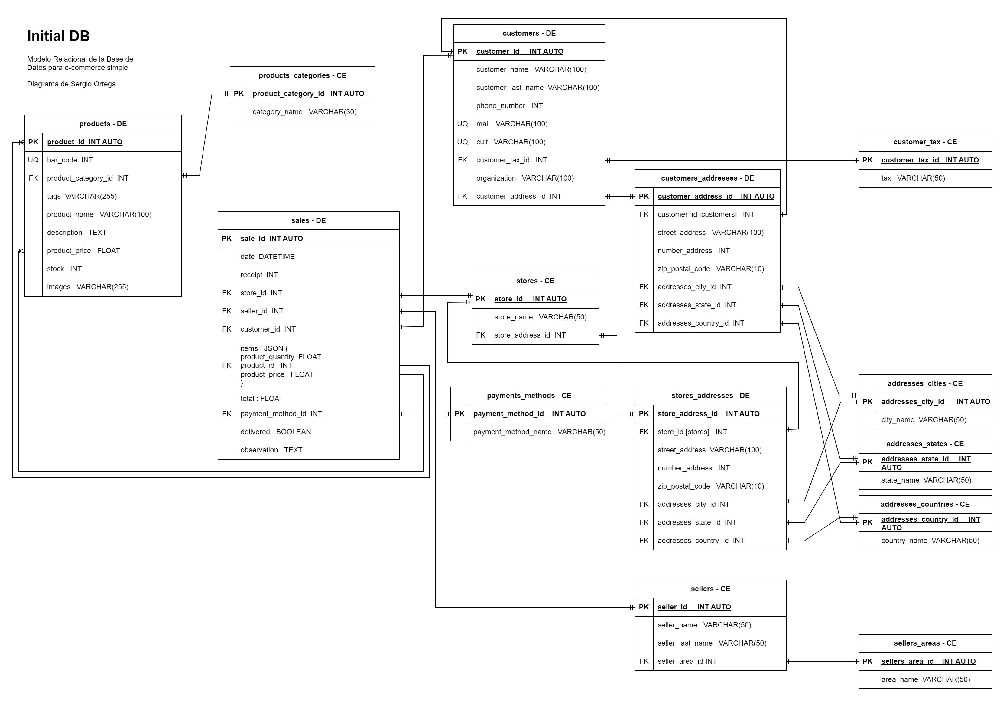

# Simple E Commerce Initial DB

## Entity List

1. Products [products](#1-products-data-entity)
1. Products Categories [products_categories](#2-products_categories-catalog-entity)
1. Customer [customers](#3-customers-de)
1. Customers Addresses [customers_addresses](#4-customers_addresses-de)
1. Customer TAX [customer_tax](#5-customer_tax-ce)
1. Addresses Cities [addresses_cities](#6-addresses_cities-ce)
1. Addresses Provincias [addresses_states](#7-addresses_states-ce)
1. Addresses Countries [addresses_countries](#8-addresses_countries-ce)
1. Sales [sales](#9-sales-de)
1. Sellers [sellers](#10-sellers-ce)
1. Sellers Areas [sellers_areas](#11-sellers_areas-ce)
1. Payments Methods [payments_methods](#12-payments_methods-ce)
1. Stores [stores](#13-stores-ce)
1. Stores Addresses [stores_addresses](#14-stores_addresses-de)

---

## Entities

## 1 products **[Data Entity]**

1. product_id : INT AUTO **[PK]**
1. bar_code : INT **[UQ]**
1. product_category_id [products_categories] : INT **[FK]**
1. tags : VARCHAR(255) (Debería ser un array de VARCHAR(30) )
1. product_name : VARCHAR(100)
1. description : TEXT
1. product_price : FLOAT
1. stock : INT
1. images : VARCHAR(255) (Debería ser un array de VARCHAR(30) )

## 2 products_categories **[Catalog Entity]**

1. product_category_id : INT AUTO **[PK]**
1. category_name : VARCHAR(30)

## 3 customers **[DE]**

1. customer_id : INT AUTO **[PK]**
1. customer_name : VARCHAR(100)
1. customer_last_name : VARCHAR(100)
1. phone_number : INT
1. mail : VARCHAR(100) **[UQ]**
1. cuit : VARCHAR(100) **[UQ]**
1. customer_tax_id [customer_tax] : INT **[FK]**
1. organization : VARCHAR(100)
1. customer_address_id [customer_addresses] : INT **[FK]**

## 4 customers_addresses **[DE]**

1. customer_address_id : INT AUTO **[PK]**
1. customer_id [customers] : INT **[FK]**
1. street_address : VARCHAR(100)
1. number_address : INT
1. zip_postal_code : VARCHAR(10)
1. addresses_city_id [addresses_cities] : INT **[FK]**
1. addresses_state_id [addresses_states] : INT **[FK]**
1. addresses_country_id [addresses_countries] : INT **[FK]**

## 5 customer_tax **[CE]**

1. customer_tax_id : INT AUTO **[PK]**
1. tax : VARCHAR(50)

## 6 addresses_cities **[CE]**

1. addresses_city_id : INT AUTO **[PK]**
1. city_name : VARCHAR(50)

## 7 addresses_states **[CE]**

1. addresses_state_id : INT AUTO **[PK]**
1. state_name : VARCHAR(50)

## 8 addresses_countries **[CE]**

1. addresses_country_id : INT AUTO **[PK]**
1. country_name : VARCHAR(50)

## 9 sales **[DE]**

1. sale_id : INT AUTO **[PK]**
1. date : DATETIME
1. receipt : INT
1. store_id [stores] : INT **[FK]**
1. seller_id [sellers] : INT **[FK]**
1. customer_id [customers] : INT **[FK]**
1. items : JSON {

- product_quantity : FLOAT
- product_id [products] : INT **[FK]**
- product_price [products] : FLOAT **[FK]**
  }

1. total : FLOAT
1. payment_method_id [payments_methods] : INT **[FK]**
1. delivered : BOOLEAN
1. observation : TEXT

## 10 sellers **[CE]**

1. seller_id : INT AUTO **[PK]**
1. seller_name : VARCHAR(100)
1. seller_last_name : VARCHAR(100)
1. sellers_area_id [sellers_areas] : INT **[FK]**

## 11 sellers_areas **[CE]**

1. sellers_area_id : INT AUTO **[PK]**
1. area_name : VARCHAR(50)

## 12 payments_methods **[CE]**

1. payment_method_id : INT AUTO **[PK]**
1. payment_method_name : VARCHAR(50)

## 13 stores **[CE]**

1. store_id : INT AUTO **[PK]**
1. store_name : VARCHAR(50)
1. store_address_id [stores_addresses] : INT **[FK]**

## 14 stores_addresses **[DE]**

1. store_address_id : INT AUTO **[PK]**
1. store_id [stores] : INT **[FK]**
1. street_address : VARCHAR(100)
1. number_address : INT
1. zip_postal_code : VARCHAR(10)
1. addresses_city_id [addresses_cities] : INT **[FK]**
1. addresses_state_id [addresses_states] : INT **[FK]**
1. addresses_country_id [addresses_countries] : INT **[FK]**

---

## Relaciones

1. Un **product** _pertenece_ a un **products category** _(1 a 1)_
1. Un **customer** _pertenece_ a un **customer tax** _(1 a 1)_
1. Un **customer** _pertenece_ a un **customer address**
1. Un **customer_address** _pertenece_ a un **customer** _(1 a 1)_
1. Un **customer_address** _pertenece_ a un **address cities** _(1 a 1)_
1. Un **customer_address** _pertenece_ a un **address state** _(1 a 1)_
1. Un **customer_address** _pertenece_ a un **address country** _(1 a 1)_
1. Un **sale** _pertenece_ a un **store** _(1 a 1)_
1. Un **sale** _pertenece_ a un **saller** _(1 a 1)_
1. Un **sale** _pertenece_ a un **customer** _(1 a 1)_
1. Un **sale** _pertenece_ a varios **product id** _(1 a Muchos)_
1. Un **sale** _pertenece_ a varios **product price** _(1 a Muchos)_
1. Un **sale** _pertenece_ a un **payment method** _(1 a 1)_
1. Un **seller** _pertenece_ a un **seller area** _(1 a 1)_
1. Un **store** _pertenece_ a un **stores address** _(1 a 1)_
1. Un **stores_address** _pertenece_ a un **store** _(1 a 1)_
1. Un **stores_address** _pertenece_ a un **address cities** _(1 a 1)_
1. Un **stores_address** _pertenece_ a un **address state** _(1 a 1)_
1. Un **stores_address** _pertenece_ a un **address country** _(1 a 1)_

---

### Diagrama

## Modelo Relacional de la Base de Datos

---

## Reglas de Negocio

#### _Las operaciones CRUD_ por cada Entidad

## products, products_categories, customers, customers_addresses, customer_tax, addresses_cities, addresses_states, addresses_countries, sales, sellers, sellers_areas, payments_methods, stores, stores_addresses

1. Crear el registro.
1. Leer el registro, dada una condición en particular.
1. Leer todos los registros.
1. Modificar los datos dada una condición en particular.
1. Eliminar el registro dada una condición en particular
